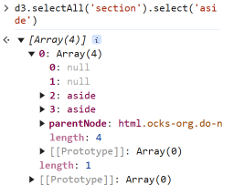

# D3 Selections

3 methods:
  `d3.select(selector)` - select a single element from the document
  `d3.selectAll(selector)` - select multiple elements from the document
  `d3.selection()` - select the root element in the document

  `selection` is a subclass of Array that returns one 'group'; further selections can be called on that group
  `d3.select('body')` returns an Array of 1 item, an array holding all the child elements in the document
  `d3.select('body')[0][0]` - returns an array of all the body elements
  `d3.select('h2')` - returns array of all h2 elements found
      the array returned has a length of 1
      the `result[0][0].length` returns the # of 'h2' elements found
  
  To get a selection with multiple groups,  use `selectAll`

  

For all intents and purposes you can ignore this; D3 handles the group feature a call to define `selection.attr` or `selections.style` will automatically go through each element the selection returns.

`select` preserves the existing grouping and propogates data from parent to child
  and `.append` and `.insert` do the same
  i.e. `d3.select('section').append('p')` will select all sections and append a new paragraph to each

`selectAll` does not, so a `.join` is needed to propogate data from parent to child

`#null` elements are returned (in the order they encountered) when elements are found that do not match the subsquent selection material; for example, in the following 4 sections are returned but only two have `aside` elements

  

## Data Binding

Data is bound to elements, not selections. Changes get stored in the DOM.
The data stored in an element can be seen in `0.__data__`
Data can be passed as a constant value or a function.
CAVEAT: `selection.data` defines data per group, not element
  A grouped selection will have grouped data
  hence the use of `key:value` pairs - they identify which *group* (key) the data (value) will be assigned to
Each group is joined independently; only need to worry about `key:value` pairs within each group, not across all groups

`.join` consists of three actions:
  enter - no match, create a new element
  update - match, modify the existing element
  exit - no match, item placed in 'exit' section

Critical to call `selectAll` before a `.join` as new elements require the parte data

## Auxiliary Functions

D3 has three *generator* functions:

* `d3.matcher(selector)` - returns a function that when run returns true if this matches the selector passed in as an argument.
* `d3.selector(selector)` - returns a function that when run returns the first descendant of this that matches the selector passed in as an argument.
* `d3.selectorAll(selector)` - returns a function that when run returns a NodeList containing the descendant of this that matches the selector passed in as an argument. [Handy if you only want the immediate descendents of a specific elements (??)]

## Other Functions

* `d3.create(name)` - creates and returns an unattached element in the current document
* `d3.creator(name)` - creates and returns a function that creates unattached elements in the current document.

* `selection.append(type)` - create, append, and select new elements
* `selection.insert(type[, selector])` - create, insert and select new elements (new elements can only be 'inserted' as children of the selected elements)
* `selection.call()` - to add across multiple selection

* `selection.clone([deep])` - insert clones of selected elements
* `selection.remove()` - remove elements from the document
* `selection.raise()` - reinsert selected elements into the DOM as the last child of their respective parents
* `selection.lower()` - reinsert selection elements into the DOM as the last child of their respective parents

## Resources

[Using D3.js](https://using-d3js.com/index.html) Selections
[How Selections Work](https://bost.ocks.org/mike/selection/)
